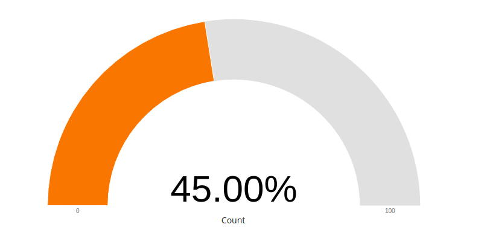

kibana-plugin-gauge
===================



Introduction
-------------

Ce plugin permet la création d'un graphique de type jauge sur Kibana Version 5.x:

* Définition du label
* Choix des couleurs
* Choix des niveaux


Contenu
-------
```
.
├── index.js
├── package.json
├── public
│   ├── bower_components
│   │   └── c3
│   ├── gauge_sg_controller.js
│   ├── gauge_sg.html
│   ├── gauge_sg.js
│   ├── gauge_sg.less
│   └── gauge_sg_params.html
└── README.md
```
Le plugin a été créé à partir des librairies Kibana et basé sur le framework Angularjs.

Liste des librairies ajoutées:

* c3.js: C3 makes it easy to generate D3-based charts by wrapping the code required to construct the entire chart. We don't need to write D3 code any more. (http://c3js.org/)


Installation
------------

Pour les versions de kibana-4.x
```
        $ cd <path>/kibana/installedPlugins
        $ git clone -b 4.x <depot> gauge-sg
```

Pour les versions de kibana-5.x
```
        $ cd <path>/kibana/plugins
        $ git clone <depot> gauge-sg
```

Désinstallation
---------------

```
        $ bin/kibana plugin  --remove gauge_sg
```
